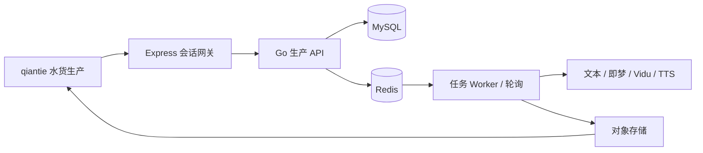

# 水货生产 ai-video 等价补齐与运行恢复设计

## 结论与目标

当前 `/shuihuo-production` 是 qiantie 内部的独立小说视频生产模块，不是 `/Users/ming/Downloads/ai-video` 的原样迁入：它已具备项目、分段审核、资产候选、人工素材、即梦图片和 Vidu 图生视频的代码主链，但运行中的 Go 服务未加载新路由，且编辑器布局与能力面均未等价。

本设计的目标是在保留 qiantie 的统一账号、导航、主题、权限和后台模型配置前提下，使水货生产达到 ai-video 的可用功能等价。旧 ai-video 仅用于核对用户可见流程、模型能力和参数语义；不得迁移 Vue/Python 服务、旧登录、数据库、历史项目、`.env`、凭据、TLS 绕过或本地目录写入逻辑。

## 方案比较

### 方案 A：先恢复运行，再分阶段实现等价功能（采用）

先将 4000 切换为当前 qiantie Go 二进制并完成健康检查，再按“编辑器、导入与模板、生成参数与配音、导出”分阶段补齐。每阶段有独立可用入口和验收记录。

- 优点：最快恢复已写功能；可逐阶段验证；不破坏现有项目数据；避免把不可用按钮误当完成。
- 代价：功能等价不是一次完成，需要四个阶段。

### 方案 B：先照抄旧版界面，再回补接口

- 优点：视觉表面最快接近旧版。
- 风险：会再次出现按钮存在但后端不可用的情况；不采用。

### 方案 C：运行旧 ai-video 并在 qiantie 内嵌入

- 优点：短期表面最接近。
- 风险：两套账号、端口、任务和凭据边界，且违背独立模块要求；不采用。

## 总体架构

浏览器只调用 qiantie 的 `/api/shuihuo-production/*`。Express 负责平台会话验证与受限转发；Go 负责领域状态、MySQL、Redis 任务、对象存储、供应商适配器与权限控制。普通用户只看到已启用模型的名称、参数和安全错误；模型密钥、提示词正文、请求模板、供应商原始响应和内部日志仅存在服务端或管理员受限界面。

## 阶段 0：恢复已实现链路

### 范围

- 用当前源码构建并启动 Go 服务，替换当前监听 4000 的旧 `/tmp/qiantie-new` 进程。
- 保留 3000 Express 服务和现有登录会话；不重置工作树。
- 验证 `/healthz` 与认证后的 `/api/shuihuo-production/health`，并在浏览器看到真实依赖状态。

### 验收

- `/api/shuihuo-production/health` 不再返回 404。
- 缺 Redis、模型或对象存储时显示明确不可用原因，而不是假成功。
- 项目列表、打开项目、分段与素材 API 能到达新 Go 服务。

## 阶段 1：等价分镜编辑器

### 界面

在水货生产内将“分段生产台”改为旧版的单项目编辑工作面，不跳转出 qiantie：顶部工具栏、批量操作栏、每段固定六列。

| 列 | 内容 | 规则 |
| --- | --- | --- |
| 内容 | 原文/字幕 | 可编辑并持久化 |
| 角色 | 人物模板与资产绑定 | 可多选，不自动覆盖人工绑定 |
| 图片提示词 | 图像提示词及锁定状态 | 手动编辑后锁定，AI 不覆盖 |
| 图片 | 候选图、主图、上传/删除/预览 | 一段一张主图，生成结果可保留多个候选 |
| 视频提示词 | 视频提示词及锁定状态 | 手动编辑后锁定 |
| 视频 | 视频预览、重试、下载 | 任务完成后可查看和下载单段 |

顶部保留：返回作品列表、角色模板、前后缀、调整分镜、更新角色、批量生成图片、批量生成视频、项目文件和导出入口。未实现的功能不显示为可用，或明确标注“下一阶段”，不允许假点击。

### 数据与接口

- 扩充当前项目、分段、资产和媒体模型，不改变既有 ID 与所有者隔离。
- 新增批量任务提交接口，支持选择全部或指定分段；每段独立任务、状态和错误。
- 图片候选与主图关系持久化；视频提交只接受对应分段的主图片。

### 验收

- 浏览器中可编辑六列并刷新后保持。
- 批量提交只处理勾选或符合条件的分段；失败不覆盖已完成结果。
- 使用 `domSnapshot`、控制台错误和后端接口三种证据分别记录。

## 阶段 2：导入、模板与受控提示词

### 范围

- 创建作品支持粘贴或上传 `.txt`/Markdown 原文；项目内支持 `.srt` 字幕和音频文件。
- 角色类型、角色模板、参考图、人工上传和受控图片重生成；模板可绑定多个分段。
- 项目补充词及图/视频前后缀管理；系统预设词由管理后台多版本维护，项目只保存所选版本与渲染快照，不把系统正文给普通用户。
- 保留“资产分析候选”，但候选只能预填，必须由用户保存；人工编辑与锁定提示词默认不覆盖。

### 验收

- TXT、SRT、音频各自有类型校验、大小限制、对象存储记录和下载。
- 模板删除会阻止或要求解除关联，不能产生悬空绑定。
- 预设词版本可追溯，普通用户的 API 响应不含系统提示词正文。

## 阶段 3：生成能力与参数等价

### 范围

- 图像：仅生成提示词、使用已有提示词生图、提示词加生图；图数、比例、尺寸/分辨率由已启用模型的公开能力约束。
- 视频：保留图生视频，新增文生视频；支持同样的三种生成模式、时长/比例等已启用模型参数。
- 配音：新增 HTTPS TTS 服务端适配器、发音人/语速/情绪等用户偏好快照、异步任务、音频素材与播放下载。不得复用现有 HTTP TTS 代理作为 Worker。
- 所有异步任务支持排队、运行、成功、失败、取消、重试和服务重启后恢复；外部回调必须幂等。

### 验收

- 未配置模型时不能提交；已配置但上游失败时只显示安全错误与可重试状态。
- 模型参数在后端白名单校验，前端不能传入任意端点、请求模板或密钥。
- 每个完成任务有模型版本、提示词版本、任务 ID 与结果媒体 ID。

## 阶段 4：可交付导出

### 范围

- 单段媒体下载。
- 按用户选定分段导出 ZIP；只包含已完成素材与清单。
- 服务端视频合并，支持选取的音频与字幕。
- 生成剪映草稿包并输出为下载文件，不向服务器任意本地路径写入。

### 验收

- 导出是异步任务，有进度、取消、失败与下载记录。
- 不含未完成、无权限或跨项目素材。
- 剪映草稿包结构和素材引用由自动测试及实际导入验证。

## 风险与边界

- 目前 4000 的旧服务进程是第一阻塞项；恢复它之前，前端不能称为可用。
- 外部文本、即梦、Vidu、TTS 凭据和 Redis 均未配置时，只能验证界面和受控失败状态，不能证明真实模型生成。
- 旧 ai-video 的视频合并、剪映导出和 TTS 实现不得照搬，需以 qiantie 服务端适配、对象存储和权限模型重做。
- 工作树已有大量未提交改动。本工作只新增与水货生产相关的文件；不执行 reset、checkout 或批量格式化。

## 完成定义

只有当四阶段均完成、生产 Go 服务已部署、每项能力具备页面入口/API/持久化/权限检查/真实浏览器交互验证，且一次真实项目可从原文走到分镜、素材、配音和导出时，才可称为“ai-video 功能和布局已完整迁入 qiantie”。
